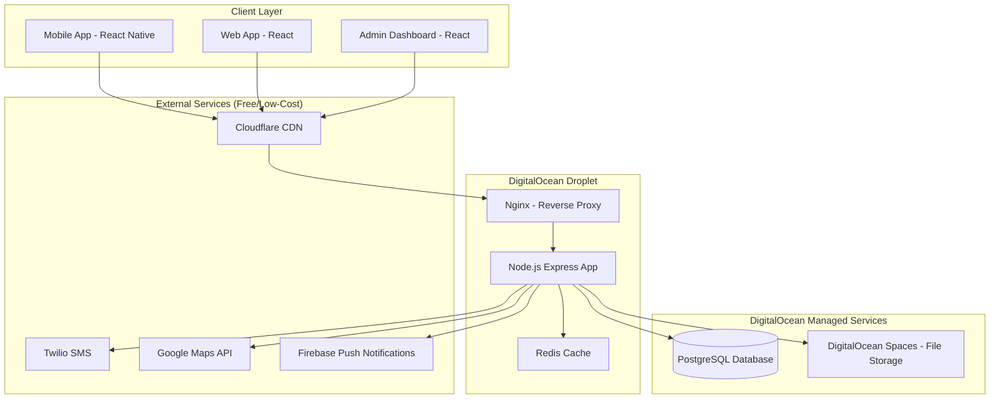
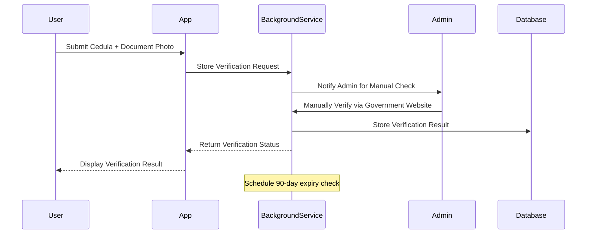
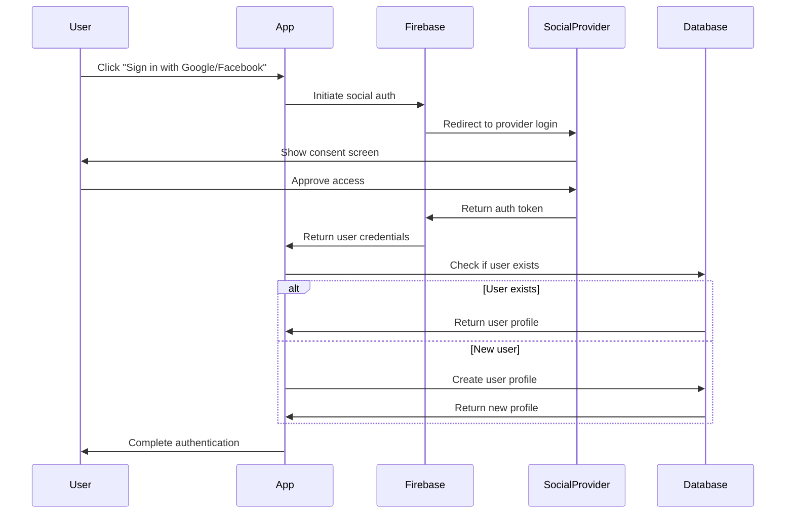

# Design Document - Ecuador Rideshare App

## Overview

The Ecuador Rideshare App is a mobile-first platform that connects passengers and drivers for inter-city transportation across Ecuador. The system prioritizes safety through comprehensive verification, provides real-time communication, and offers a seamless booking experience with Ecuador-specific cultural and linguistic considerations.

### Key Design Principles
- **Safety First**: Comprehensive background checks and verification system
- **Real-time Communication**: Instant messaging and live trip updates
- **Cultural Relevance**: Spanish-first interface with Ecuador-specific features
- **Mobile-Optimized**: Responsive design prioritizing mobile experience
- **Scalable Architecture**: Support for growth across Ecuador's cities

## Architecture

### System Architecture
**Cost-Efficient Monolithic Architecture** for Ecuador deployment:



**Simplified Service Architecture:**
```
Single Express.js Application:
├── /api/auth (authentication)
├── /api/users (user management)
├── /api/trips (trip management)
├── /api/bookings (booking system)
├── /api/messages (messaging via Socket.io)
├── /api/verification (document verification)
├── /api/admin (admin functions)
└── /static (admin dashboard files)
```

### Technology Stack

#### **Cost-Efficient Stack for Ecuador Deployment**

**Frontend:**
- **Mobile**: React Native (single codebase for iOS/Android)
- **Web App**: React (full user-facing web application)
- **Admin Dashboard**: React (admin management interface)

**Backend:**
- **Runtime**: Node.js with Express.js
- **Database**: PostgreSQL (single database instead of multiple)
- **Caching**: Redis (for sessions and search results)
- **Real-time**: Socket.io for messaging
- **Authentication**: JWT with refresh tokens

**Infrastructure (Cost-Optimized):**
- **Hosting**: DigitalOcean Droplets (cheaper than AWS for small scale)
- **File Storage**: DigitalOcean Spaces (S3-compatible, lower cost)
- **CDN**: Cloudflare (free tier)
- **Maps**: Google Maps API (free tier: 28,000 map loads/month)
- **SMS**: Twilio (pay-per-use)
- **Push Notifications**: Firebase (free tier)

**Simplified Architecture:**
- **Single PostgreSQL database** (instead of PostgreSQL + MongoDB + Redis)
- **Monolithic backend** (instead of microservices)
- **Static file hosting** on CDN (instead of separate web server)

## Cost-Efficient Deployment Strategy

### **Phase 1: MVP Launch (0-1000 users) - ~$50-80/month**

**Infrastructure:**
- **DigitalOcean Droplet**: $20/month (2GB RAM, 1 vCPU, 50GB SSD)
- **DigitalOcean Managed PostgreSQL**: $15/month (1GB RAM, 1 vCPU, 10GB storage)
- **DigitalOcean Spaces**: $5/month (250GB storage + CDN)
- **Cloudflare**: Free (CDN + SSL for web app)
- **Firebase**: Free tier (push notifications)
- **Google Maps API**: Free (28,000 map loads/month)
- **Twilio SMS**: ~$10/month (estimated usage)

**Web Application Hosting:**
- **Vercel/Netlify**: Free tier (perfect for React web app)
- **Alternative**: Serve from same droplet (no extra cost)

**Services Stack:**
```
Single Droplet:
├── Node.js Backend (Express + Socket.io)
├── React Web App (served as static files)
├── React Admin Dashboard (served as static files)
├── Redis (in-memory, same server)
└── Nginx (reverse proxy + static files)
```

**Alternative Web Hosting (Recommended):**
```
Vercel/Netlify (Free):
├── React Web App (rideshare.app)
└── React Admin Dashboard (admin.rideshare.app)

DigitalOcean Droplet:
└── Node.js API Backend only
```

### **Phase 2: Growth (1000-10000 users) - ~$150-200/month**

**Scaling Strategy:**
- **App Droplet**: $40/month (4GB RAM, 2 vCPU)
- **Database**: $30/month (2GB RAM, 1 vCPU, 25GB storage)
- **Load Balancer**: $12/month (DigitalOcean)
- **Spaces Storage**: $10/month (500GB)
- **Monitoring**: $10/month (DigitalOcean Monitoring)

### **Phase 3: Scale (10000+ users) - ~$300-500/month**

**Multi-server Setup:**
- **2x App Servers**: $80/month (behind load balancer)
- **Database Cluster**: $60/month (primary + replica)
- **Redis Cluster**: $20/month (separate caching layer)
- **File Storage**: $20/month (1TB+ with CDN)

### **Ecuador-Specific Optimizations**

**Local Hosting Benefits:**
- **Lower Latency**: Servers in South America (DigitalOcean has data centers in NYC - closest to Ecuador)
- **Currency**: Pay in USD (Ecuador's currency)
- **Compliance**: Easier to meet local data protection requirements

**Alternative Ultra-Low-Cost Option:**
- **Heroku**: $7/month (hobby dyno) + $9/month (Postgres) = $16/month for MVP
- **Supabase**: $25/month (includes database + auth + storage)
- **Vercel**: Free for frontend hosting

### **Cost Comparison (Monthly)**

| Provider | MVP Cost | Growth Cost | Enterprise Cost |
|----------|----------|-------------|-----------------|
| **DigitalOcean** | $50-80 | $150-200 | $300-500 |
| **AWS** | $100-150 | $300-500 | $800-1200 |
| **Heroku + Add-ons** | $50-100 | $200-400 | $600-1000 |
| **Supabase + Vercel** | $25-50 | $100-200 | $300-600 |

### **Recommended Tech Stack Changes for Cost Efficiency**

**Database Simplification:**
```sql
-- Single PostgreSQL database with all data
-- Instead of: PostgreSQL + MongoDB + Redis
-- Use: PostgreSQL with JSONB for flexible data + Redis for caching only
```

**Messaging Optimization:**
```javascript
// Store messages in PostgreSQL instead of MongoDB
// Use Socket.io with Redis adapter for real-time
// Reduces database costs significantly
```

## Components and Interfaces

### Core Components

#### 1. User Management Component
**Responsibilities:**
- User registration and authentication (email/password, Google, Facebook)
- Profile management
- Verification status tracking
- Rating and review system
- Social authentication integration

**Key Interfaces:**
```typescript
interface User {
  id: string;
  email: string;
  phone: string;
  firstName: string;
  lastName: string;
  profilePhoto?: string;
  verificationStatus: VerificationStatus;
  rating: number;
  totalTrips: number;
  authProvider: 'email' | 'google' | 'facebook';
  socialProviderId?: string;
  createdAt: Date;
  updatedAt: Date;
}

interface VerificationStatus {
  phoneVerified: boolean;
  identityVerified: boolean;
  backgroundCheckPassed: boolean;
  backgroundCheckDate?: Date;
  backgroundCheckExpiryDate?: Date;
  ecuadorianCedula?: string;
  passportNumber?: string;
  driverLicenseVerified?: boolean;
  vehicleRegistrationVerified?: boolean;
}
```

#### 2. Trip Management Component
**Responsibilities:**
- Trip creation and management
- Route planning and validation
- Seat availability tracking
- Trip status updates

**Key Interfaces:**
```typescript
interface Trip {
  id: string;
  driverId: string;
  departureCity: string;
  destinationCity: string;
  departureDateTime: Date;
  estimatedArrivalDateTime: Date;
  availableSeats: number;
  pricePerSeat: number;
  status: TripStatus;
  vehicleInfo: VehicleInfo;
  route: RoutePoint[];
  createdAt: Date;
}

interface VehicleInfo {
  make: string;
  model: string;
  year: number;
  color: string;
  licensePlate: string;
}
```

#### 3. Booking Management Component
**Responsibilities:**
- Seat reservation and booking
- Payment method coordination (bank transfer/cash)
- Booking confirmation and cancellation
- Passenger manifest management

**Key Interfaces:**
```typescript
interface Booking {
  id: string;
  tripId: string;
  passengerId: string;
  seatsBooked: number;
  totalAmount: number;
  paymentMethod: 'bank_transfer' | 'cash';
  paymentStatus: 'pending' | 'confirmed' | 'completed';
  bookingStatus: BookingStatus;
  bookingDate: Date;
  cancellationReason?: string;
}
```

#### 4. Messaging Component
**Responsibilities:**
- End-to-end encrypted messaging
- Real-time message delivery
- Message history management
- File sharing capabilities

**Key Interfaces:**
```typescript
interface Message {
  id: string;
  conversationId: string;
  senderId: string;
  content: string;
  messageType: MessageType;
  timestamp: Date;
  encrypted: boolean;
  readStatus: ReadStatus;
}

interface Conversation {
  id: string;
  tripId: string;
  participants: string[];
  lastMessage?: Message;
  createdAt: Date;
}
```

#### 5. Verification Component
**Responsibilities:**
- Document upload and validation
- Ecuador government background check integration
- Verification workflow management
- Compliance tracking
- Background check expiry monitoring (90-day cycle)

**Key Interfaces:**
```typescript
interface VerificationDocument {
  id: string;
  userId: string;
  documentType: DocumentType;
  documentUrl: string;
  verificationStatus: DocumentVerificationStatus;
  submittedAt: Date;
  reviewedAt?: Date;
  reviewNotes?: string;
}

interface BackgroundCheckRequest {
  userId: string;
  documentType: 'cedula' | 'passport';
  documentNumber: string;
  requestDate: Date;
  expiryDate: Date;
}

interface BackgroundCheckResponse {
  isValid: boolean;
  hasRecords: boolean;
  checkDate: Date;
  expiryDate: Date;
  errorMessage?: string;
}
```

## Data Models

### Database Schema Design

#### Users Table
```sql
CREATE TABLE users (
  id UUID PRIMARY KEY DEFAULT gen_random_uuid(),
  email VARCHAR(255) UNIQUE NOT NULL,
  phone VARCHAR(20) UNIQUE NOT NULL,
  password_hash VARCHAR(255) NOT NULL,
  first_name VARCHAR(100) NOT NULL,
  last_name VARCHAR(100) NOT NULL,
  profile_photo_url TEXT,
  date_of_birth DATE,
  rating DECIMAL(3,2) DEFAULT 0.00,
  total_trips INTEGER DEFAULT 0,
  verification_status JSONB DEFAULT '{}',
  created_at TIMESTAMP DEFAULT CURRENT_TIMESTAMP,
  updated_at TIMESTAMP DEFAULT CURRENT_TIMESTAMP
);
```

#### Trips Table
```sql
CREATE TABLE trips (
  id UUID PRIMARY KEY DEFAULT gen_random_uuid(),
  driver_id UUID REFERENCES users(id),
  departure_city VARCHAR(100) NOT NULL,
  destination_city VARCHAR(100) NOT NULL,
  departure_datetime TIMESTAMP NOT NULL,
  estimated_arrival_datetime TIMESTAMP NOT NULL,
  available_seats INTEGER NOT NULL,
  price_per_seat DECIMAL(10,2) NOT NULL,
  status VARCHAR(20) DEFAULT 'active',
  vehicle_info JSONB NOT NULL,
  route JSONB,
  created_at TIMESTAMP DEFAULT CURRENT_TIMESTAMP,
  updated_at TIMESTAMP DEFAULT CURRENT_TIMESTAMP
);
```

#### Bookings Table
```sql
CREATE TABLE bookings (
  id UUID PRIMARY KEY DEFAULT gen_random_uuid(),
  trip_id UUID REFERENCES trips(id),
  passenger_id UUID REFERENCES users(id),
  seats_booked INTEGER NOT NULL,
  total_amount DECIMAL(10,2) NOT NULL,
  payment_method VARCHAR(20) NOT NULL,
  payment_status VARCHAR(20) DEFAULT 'pending',
  booking_status VARCHAR(20) DEFAULT 'confirmed',
  booking_date TIMESTAMP DEFAULT CURRENT_TIMESTAMP,
  cancellation_reason TEXT
);
```

#### Background Check Tables
```sql
CREATE TABLE background_checks (
  id UUID PRIMARY KEY DEFAULT gen_random_uuid(),
  user_id UUID REFERENCES users(id),
  document_type VARCHAR(20) NOT NULL, -- 'cedula' or 'passport'
  document_number VARCHAR(50) NOT NULL,
  check_date TIMESTAMP NOT NULL,
  expiry_date TIMESTAMP NOT NULL,
  is_valid BOOLEAN NOT NULL,
  has_records BOOLEAN NOT NULL,
  api_response JSONB,
  created_at TIMESTAMP DEFAULT CURRENT_TIMESTAMP
);

CREATE INDEX idx_background_checks_user_id ON background_checks(user_id);
CREATE INDEX idx_background_checks_expiry ON background_checks(expiry_date);
```

## Ecuador Background Check Integration

### Background Check Integration Design
**Important**: Ecuador's government website (`https://certificados.ministeriodelinterior.gob.ec/gestorcertificados/antecedentes/`) is a web form interface, not a public API. Therefore, we need to create our own secure background check verification system.

#### Integration Architecture Options

**Option 1: Web Scraping (Not Recommended)**
- Automated form submission to government website
- Legal and technical risks
- Unreliable due to website changes

**Option 2: Manual Verification Process (Recommended)**


**Option 3: Third-Party Service Integration**
- Partner with licensed verification services in Ecuador
- More expensive but automated
- Requires business partnerships

#### Background Check Service Implementation
```typescript
interface EcuadorBackgroundCheckRequest {
  tipoDocumento: 'CI' | 'PA'; // CI = Cedula, PA = Passport
  numeroDocumento: string;
  nombres?: string; // Optional: First names
  apellidos?: string; // Optional: Last names
  fechaNacimiento?: string; // Optional: Birth date (YYYY-MM-DD)
}

interface EcuadorAPIResponse {
  success: boolean;
  tieneAntecedentes: boolean; // Has criminal records
  mensaje: string;
  detalles?: {
    fechaConsulta: string;
    numeroDocumento: string;
    estado: 'LIMPIO' | 'CON_ANTECEDENTES';
  };
}

class EcuadorBackgroundCheckService {
  
  async submitVerificationRequest(
    documentType: 'cedula' | 'passport',
    documentNumber: string,
    firstName: string,
    lastName: string,
    birthDate: string,
    documentPhotoUrl: string,
    userId: string
  ): Promise<BackgroundCheckSubmissionResponse> {
    // Validate document format (Ecuador cedula algorithm)
    // Store verification request in database with 'pending' status
    // Upload document photo to secure storage
    // Create admin notification for manual verification
    // Return submission confirmation
  }
  
  async processManualVerification(
    requestId: string,
    adminId: string,
    verificationResult: {
      isValid: boolean;
      hasRecords: boolean;
      notes: string;
    }
  ): Promise<void> {
    // Update verification status in database
    // Set 90-day expiry date
    // Notify user of verification result
    // Update user's verification status
  }
  
  async checkExpiringVerifications(): Promise<void> {
    // Find users with background checks expiring in 7 days
    // Send notification to re-verify
    // Mark as expired after 90 days
  }
  
  private validateEcuadorianCedula(cedula: string): boolean {
    // Implement Ecuador's official cedula validation algorithm
    // 10-digit format with check digit validation
  }
}
```

#### User Interface Requirements
**Background Check Verification Screen** should collect:

**For Ecuadorian Citizens (Cedula):**
- Document Type: "Cédula de Identidad"
- Cedula Number: 10-digit input with validation
- First Names: Text input (optional for verification)
- Last Names: Text input (optional for verification)
- Birth Date: Date picker (optional for verification)

**For Foreign Nationals (Passport):**
- Document Type: "Pasaporte"
- Passport Number: Alphanumeric input
- First Names: Text input (optional)
- Last Names: Text input (optional)
- Birth Date: Date picker (optional)

**Validation Rules:**
- **Cedula Ecuatoriana**: 10-digit format with Ecuador's check digit algorithm
- **Passport**: 6-9 alphanumeric characters
- **Names**: Optional but improve verification accuracy
- **Birth Date**: Optional but recommended for verification

#### API Integration Details
- **Endpoint**: `https://certificados.ministeriodelinterior.gob.ec/gestorcertificados/antecedentes/`
- **Method**: POST
- **Content-Type**: application/json
- **Rate Limiting**: Respect government API limits (max 10 requests/minute)
- **Timeout**: 30 seconds
- **Retry Logic**: 3 attempts with exponential backoff
- **Error Handling**: Graceful handling of API downtime with user-friendly messages

#### Expiry Management
- **90-Day Cycle**: Background checks expire after 90 days
- **7-Day Warning**: Notify users 7 days before expiry
- **Auto-Disable**: Disable ride creation/booking for expired checks
- **Re-verification**: Streamlined process for renewal

### Social Authentication Integration

#### Firebase Authentication with Social Providers

**Supported Providers:**
- **Google Sign-In**: OAuth 2.0 authentication via Google
- **Facebook Login**: OAuth 2.0 authentication via Facebook

**Authentication Flow:**


**Implementation Details:**

**For React Native Mobile:**
```typescript
// Use @react-native-google-signin/google-signin for Google
// Use react-native-fbsdk-next for Facebook
// Firebase handles the authentication after getting tokens

interface SocialAuthConfig {
  google: {
    webClientId: string; // From Firebase Console
    iosClientId: string; // From Firebase Console
  };
  facebook: {
    appId: string; // From Facebook Developer Console
    appName: string;
  };
}
```

**For Web Application:**
```typescript
// Use Firebase signInWithPopup for web
// Simpler implementation, no additional packages needed

import { signInWithPopup, GoogleAuthProvider, FacebookAuthProvider } from 'firebase/auth';
```

**User Profile Creation:**
- Extract name, email, and profile photo from social provider
- Create user document in Firestore with `authProvider` field
- Link social account to existing profile if email matches
- Require phone verification for social auth users (for safety)

**Security Considerations:**
- Validate tokens server-side
- Store social provider ID for account linking
- Implement account merging for users with same email
- Require additional verification for drivers even with social auth

### Caching Strategy
- **Redis Cache**: User sessions, frequently accessed trip data, search results, background check status
- **Cache TTL**: 
  - User sessions: 24 hours
  - Trip search results: 5 minutes
  - User profiles: 1 hour
  - Background check status: 6 hours

## Error Handling

### Error Categories and Responses

#### 1. Validation Errors (400)
```typescript
interface ValidationError {
  code: 'VALIDATION_ERROR';
  message: string;
  field: string;
  details: string;
}
```

#### 2. Authentication Errors (401/403)
```typescript
interface AuthError {
  code: 'AUTH_ERROR' | 'INSUFFICIENT_PERMISSIONS';
  message: string;
  requiredVerification?: string[];
}
```

#### 3. Business Logic Errors (422)
```typescript
interface BusinessError {
  code: 'INSUFFICIENT_SEATS' | 'TRIP_CANCELLED' | 'BOOKING_EXPIRED';
  message: string;
  context?: Record<string, any>;
}
```

#### 4. System Errors (500)
```typescript
interface SystemError {
  code: 'INTERNAL_ERROR';
  message: string;
  requestId: string;
}
```

### Error Handling Strategy
- **Client-side**: Graceful degradation with user-friendly Spanish error messages
- **Server-side**: Comprehensive logging with correlation IDs
- **Retry Logic**: Exponential backoff for transient failures
- **Circuit Breaker**: Protection against cascading failures

## Testing Strategy

### Testing Pyramid

#### 1. Unit Tests (70%)
- **Coverage Target**: 90%
- **Focus Areas**: Business logic, validation functions, utility functions
- **Tools**: Jest, React Native Testing Library
- **Example Test Categories**:
  - User validation functions
  - Trip search algorithms
  - Booking calculation logic
  - Message encryption/decryption

#### 2. Integration Tests (20%)
- **Focus Areas**: API endpoints, database operations, external service integration
- **Tools**: Supertest, Test containers
- **Example Test Scenarios**:
  - Complete booking flow
  - User verification workflow including background checks
  - Ecuador government API integration
  - Background check expiry and renewal process
  - Real-time messaging functionality
  - Payment method coordination

#### 3. End-to-End Tests (10%)
- **Focus Areas**: Critical user journeys
- **Tools**: Detox (React Native), Cypress (Web)
- **Example Test Scenarios**:
  - User registration and verification
  - Search, book, and complete trip journey
  - Driver creates trip and manages bookings
  - Cross-platform messaging functionality

### Testing Data Strategy
- **Test Database**: Separate PostgreSQL instance with Ecuador city data
- **Mock Services**: External APIs (SMS, payments, maps, Ecuador background check API)
- **Test Users**: Pre-created verified and unverified user accounts with various background check statuses
- **Test Documents**: Valid and invalid Ecuadorian cedulas and passport numbers for testing
- **Test Trips**: Sample inter-city routes across Ecuador

### Performance Testing
- **Load Testing**: Simulate peak usage during holidays/weekends
- **Stress Testing**: Database performance under high concurrent bookings
- **Mobile Performance**: App startup time, memory usage, battery consumption

### Security Testing
- **Authentication**: JWT token validation and refresh
- **Authorization**: Role-based access control
- **Data Protection**: Encryption at rest and in transit
- **Input Validation**: SQL injection, XSS prevention
- **API Security**: Rate limiting, CORS configuration

### Localization Testing
- **Spanish Language**: All UI text and error messages
- **Ecuador Specifics**: Currency formatting, phone number validation
- **Cultural Considerations**: Date/time formats, address formats
- **Accessibility**: Screen reader compatibility in Spanish
##
 Web Application & Google Maps Cost Analysis

### **Google Maps API Pricing (You're Correct!)**

**Free Tier Limits:**
- **28,000 map loads/month** (Dynamic Maps)
- **40,000 geocoding requests/month**
- **25,000 routes/month** (Directions API)

**Cost After Free Tier:**
- **$7 per 1,000 additional map loads**
- For 1,000 users: ~5,000-10,000 map loads/month = **FREE**
- Only becomes expensive at 50,000+ users

### **Web Application Hosting Options**

**Option 1: Free Hosting (Recommended)**
- **Vercel**: Free tier (100GB bandwidth, unlimited sites)
- **Netlify**: Free tier (100GB bandwidth, 300 build minutes)
- **Cost**: $0/month for web app

**Option 2: Same Server Hosting**
- Serve React web app from same DigitalOcean droplet
- **Cost**: $0/month additional (just uses existing server)

**Option 3: Separate Web Server**
- Additional $12/month droplet for web app
- **Only needed if**: High traffic or want separation

### **Updated Cost Breakdown with Web App**

| Phase | Users | Monthly Cost | Includes |
|-------|-------|--------------|----------|
| **MVP** | 0-1,000 | **$50-65** | Mobile + Web + Admin |
| **Growth** | 1,000-10,000 | **$150-200** | All apps + scaling |
| **Scale** | 10,000+ | **$300-500** | Multi-server setup |

### **Final Recommendation: Multi-Platform Stack**

**Total Cost: $50-65/month for MVP with Mobile + Web + Admin**

**Architecture:**
```
Free Tier Services:
├── Vercel: React Web App (rideshare.app)
├── Vercel: Admin Dashboard (admin.rideshare.app)
├── Google Maps: Free tier (28k loads/month)
└── Cloudflare: CDN + SSL

Paid Services:
├── DigitalOcean: $35/month (API backend)
├── PostgreSQL: $15/month (managed database)
└── Twilio SMS: $10/month (verification)
```

**Benefits:**
- ✅ **Multi-Platform**: Mobile app + Web app + Admin dashboard
- ✅ **Cost-Effective**: Web hosting is FREE
- ✅ **Google Maps**: Free tier covers initial usage perfectly
- ✅ **Scalable**: Easy to upgrade components independently
- ✅ **Professional**: Separate domains for different interfaces

**Answer: Adding a web application is essentially FREE and highly recommended!** 🚀